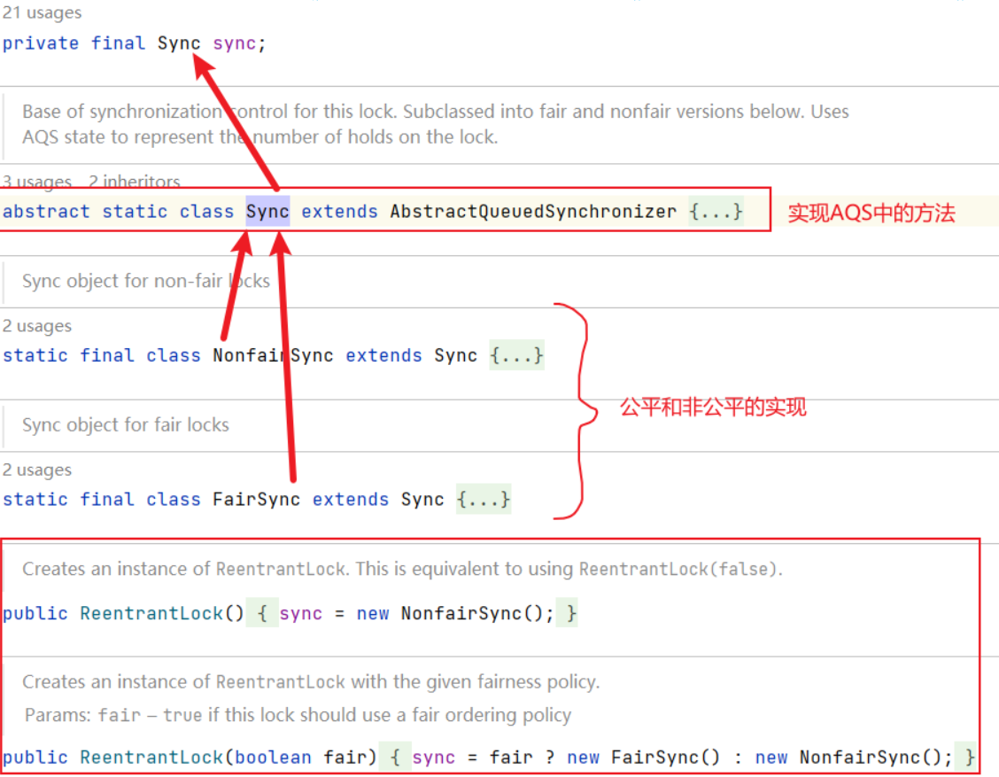

## AQS简介

java并发包提供了很多对多线程编程进行支持的的工具类，其中很大一部分的工具实现的基石都是一个叫做AQS的基础框架。

虽说是框架，其实它本身就是一个抽象类，但是其内部实现了线程并发操作的很多基础操作，然后子类根据自身需要实现不同并发特性的要求，去重写此抽象类的部分方法。

这个抽象类是 `java.util.concurrent.locks.AbstractQueuedSynchronizer`

### AQS的基本组成

以下是在JDK11版本的下的AQS基本类图组成部分：

.png)

AQS的核心有如下:

1. 两个一个叫state的int类型值，其表示当前加锁的状态，不同的并发工具实现其含义都有所不同。
2. 一个叫做CLH的队列，它的实现是一个先进先出的双线链表。

### 以ReentrantLock为入口来了解AQS

这里要解释下为什么需要以reentrantLock作为入口去解析AQS框架，因为AQS中的一些方法就是需要子类去实现了，而且不同的实现对AQS的使用是不一样的，所以以一个具体的实现作为入口可以帮助我们了解其基本的一些概念。

#### ReentrantLock的基本组成



这里可以看到reentrantLock中有一个静态的类`java.util.concurrent.locks.ReentrantLock.Sync`它继承了AQS类。而我们在构造一个reentrantLock实例的时候，会根据传参去构建对应的Sync成员变量。默认是非公平的。

#### 根据加锁和解锁的逻辑代码来刨析

```java
final ReentrantLock lock = new ReentrantLock();
// 加锁
lock.lock();
try {    
  UseMethod.doSomething();
} finally {    
  // 解锁    
  lock.unlock();
}
```

上面是一段ReentrantLock的使用代码，我们要先看其做了什么？首先看加锁的代码

```java
public void lock() {
  sync.acquire(1);
}
```

这里调用的内部sync的acquire方法，传入的值是1。

.png)

这个方法是再AQS类中的，并且是final禁止子类去覆盖，是一个很重要的方法。上面是源码部分，我我们将其拆解一下，方便理解：

```java
// 这个方法是写在AQS的类中的，其实所有的加锁逻辑都在其中
public final void acquire(int arg) {
  // 尝试加锁，并传入加锁的参数，如果加锁那个成功直接就返回了
  if(tryAcquire(arg)) {
    return;
  }
  // 如果获取锁失败，构造一个 Node.EXCLUSIVE 类型的节点，并将其放入CLH队列中
  Node node = addWaiter(Node.EXCLUSIVE);
  // 将节点中的线程进行等待，并返回是否被中断，如果其他的线程调用了node线程中的中断方法，这里就是true
  boolean interrupted = acquireQueued(node, arg);
  // 如果被中断了
  if ( interrupted )
    // 将线程的标记位为true
    selfInterrupt();
}
```

我们再逐一看一下里面的方法，首先是在子类中实现的 tryAcquire 方法。针对ReentrantLock来说，其公平和非公平实现不同，我们直接看代码。

公平锁实现

```java
@ReservedStackAccess
protected final boolean tryAcquire(int acquires) {
  final Thread current = Thread.currentThread();
  // 获取状态，对于ReentrantLock，状态值为0表示其他线程未获取到锁，大于0表示锁被占有，并且值的大小表示占有锁的线程重入的次数
  int c = getState();
  // 没有线程抢占到锁
  if (c == 0) {
    // hasQueuedPredecessors() 如果当前线程有在排队的线程就返回true，这就表示只有当前线程位于队列的头部或者队列为空的时候返回false
    // 这里是取反判断当前线程的前面如果没有线程在排队的话（这就表示是公平的，只有在队列头部或者没有线程在等待的时候才会去抢占锁），就会CAS去获取锁（就是去改变状态值），如果CAS成功，这里就是当前线程加锁成功了，把AQS中的占用锁线程值设置成当前线程
    if (!hasQueuedPredecessors() &&
        compareAndSetState(0, acquires)) {
      setExclusiveOwnerThread(current);
      return true;
    }
  }
  // 如果有线程获取到锁了，即c不等于0，此时判断获取锁的线程是不是自己，如果是自己的话，就将state + acquires（这个值在ReentrantLock中传递的就是1，这里就是自增了）
  // 这里后面setState操作就不需要cas计算了，因为本身就是当前线程拿到了锁，这块if内的逻辑就不会存在并发的可能了。
  else if (current == getExclusiveOwnerThread()) {
    int nextc = c + acquires;
    if (nextc < 0)
      throw new Error("Maximum lock count exceeded");
    setState(nextc);
    return true;
  }
  return false;
}
```

非公平锁的实现，非公平锁的实现tryAcquire方法会调用到如下的方法：

```java
@ReservedStackAccess
final boolean nonfairTryAcquire(int acquires) {
  final Thread current = Thread.currentThread();
  int c = getState();
  // 获取状态，对于ReentrantLock，状态值为0表示其他线程未获取到锁，大于0表示锁被占有，并且值的大小表示占有锁的线程重入的次数
  if (c == 0) {
    // 这里和公平锁的逻辑就是少了hasQueuedPredecessors()方法去判断当前等待队列前面是否还有等待的线程，不管前面是否有等待的，都会直接先去就会CAS去获取锁（就是去改变状态值），如果CAS成功，这里就是当前线程加锁成功了，把AQS中的占用锁线程值设置成当前线程
    if (compareAndSetState(0, acquires)) {
      setExclusiveOwnerThread(current);
      return true;
    }
  }
  // 如果有线程获取到锁了，即c不等于0，此时判断获取锁的线程是不是自己，如果是自己的话，就将state + acquires（这个值在ReentrantLock中传递的就是1，这里就是自增了） // 这里后面setState操作就不需要cas计算了，因为本身就是当前线程拿到了锁，这块if内的逻辑就不会存在并发的可能了。
  else if (current == getExclusiveOwnerThread()) {
    int nextc = c + acquires;
    if (nextc < 0) // overflow
      throw new Error("Maximum lock count exceeded");
    setState(nextc);
    return true;
  }
  return false;
}
```

说完获取锁的逻辑，再回到上面aquire方法中，第一部尝试拿锁，如果成功的话，就直接返回了，即lock加锁的逻辑就成功了，lock执行结束。

这里先初步看一下Node中的一些常量，后面会用到

.png)

如果加锁失败了，首先会执行addWaiter(Node.EXCLUSIVE) 方法，这个方法如下:

```java
// 首先传入的是一个Node节点的数据，这个其实是表示加锁的模式，在ReentrantLock中这里默认传入的是一个Node的常量，表示是独占的。
private Node addWaiter(Node mode) {
  // 这里构造函数，会设置Node的成员变量nextWaiter的值就是传入的mode，并把其thread成员变量的值设置成当前线程
  Node node = new Node(mode);

  for (;;) {
    Node oldTail = tail;
    // 这里要注意，AQS中的等待队列，头节点是不存实际的数据的，但是尾节点确实真正在等待的数据，当第一个线程第一次进来的时候，tail和head都是null
    // 这里使用尾节点如果不为空，表示队列已经初始化了， 这时候就会将创建的node的前序节点设置为历史的tail节点，并进行CAS操作将当前节点设置成尾部节点，设置成功之后，会将历史的尾节点的next设置成node节点
    if (oldTail != null) {
      node.setPrevRelaxed(oldTail);
      if (compareAndSetTail(oldTail, node)) {
        oldTail.next = node;
        return node;
      }
    // 尾节点为null，这里需要对队列进行初始化，初始化之后又会进入下一轮循环
    } else {
      initializeSyncQueue();
    }
  }
}

// AQS等待队列初始化的逻辑
private final void initializeSyncQueue() {
  // 初始化的时候，会CAS给头节点赋值一个空的node数据，CAS成功之后，就会将尾节点也指向同一个对象，这里可以认为 初始化将头和尾指向一个空node是一个原子的操作，为什么呢，因为即使这个操作是多个线程在并发初始化，也只会有一个线程能进入到下面 tail = h的方法逻辑中去。
  Node h;
  if (HEAD.compareAndSet(this, null, (h = new Node())))
    tail = h;
}
```

上面的方法执行之后，其实就是以将当前线程创建一个独占的node节点，并将当前节点放入到队列的尾部。这里最重要的是要知道head节点是不存实际等到锁的数据的，而尾节点会存储数据。

再往后就是执行acquireQueued方法，要将线程进行park挂起了。并且这个方法会返回当前线程时候中断了

```java
final boolean acquireQueued(final Node node, int arg) {
  boolean interrupted = false;
  try {
    for (;;) {
      // node.predecessor() 这个方法就是返回节点的前一个节点
      final Node p = node.predecessor();
      // 这里判断如果前一个节点是头节点的话，表示本节点是当前队列的第一个，这里再次尝试进行加锁操作，这是尽量避免线程的挂起操作。加锁成功就会设置好
      if (p == head && tryAcquire(arg)) {
        // 将当前节点设置成头节点
        setHead(node);
        p.next = null;
        return interrupted;
      }
      // 判断当前节点是否需要被阻塞，这里会根据前一个节点的状态进行判断，只有前节点ws为SIGNAL，当前节点才会需要被阻塞
      if (shouldParkAfterFailedAcquire(p, node))
        // 如果当前节点需要被挂起，就会进行阻塞操作并返回中断标记位
        interrupted |= parkAndCheckInterrupt();
    }
  } catch (Throwable t) {
    cancelAcquire(node);
    if (interrupted)
      selfInterrupt();
    throw t;
  }
}

private void cancelAcquire(Node node) {
  if (node == null)
    return;
  node.thread = null;
  // 如果前面的节点状态大于0 即也是失效的状态，这里也会一起跳过
  Node pred = node.prev;
  while (pred.waitStatus > 0)
    node.prev = pred = pred.prev;
  // predNext 这个节点是当前节点前面第一个未失效节点的后一个，即 predNext 到当前节点之间的数据都是失效的
  Node predNext 这个节点是当前节点前面第一个未失效节点的后一个，即  = pred.next;
  // 节点状态设置为取消
  node.waitStatus = Node.CANCELLED;
  // 如果要取消的节点是尾节点，就把前一个节点设置为尾
  if (node == tail && compareAndSetTail(node, pred)) {
    pred.compareAndSetNext(predNext, null);
  } else {
    int ws;
    // 这里是判断前节点是
    if (pred != head &&
        ((ws = pred.waitStatus) == Node.SIGNAL ||
         (ws <= 0 && pred.compareAndSetWaitStatus(ws, Node.SIGNAL))) &&
        pred.thread != null) {
      Node next = node.next;
      if (next != null && next.waitStatus <= 0)
        pred.compareAndSetNext(predNext, next);
    } else {
      unparkSuccessor(node);
    }
    node.next = node; // help GC
  }
}

 private void setHead(Node node) {
   head = node;
   node.thread = null;
   node.prev = null;
 }

private static boolean shouldParkAfterFailedAcquire(Node pred, Node node) {
  // 获取前一个节点的waitStatus，所有节点再被创建的时候，这个值都是0，即初始值
  int ws = pred.waitStatus;
  // waitStatus 四个几个取值的范围在node中已经定义了常量了 分别是 
  // SIGNAL      -1 代表接班人，即下一个节点的线程是可以被唤醒的
  // CONDITION   -2 表示当前节点正在等待条件，这个是后面条件队列的内容
  // PROPAGATE	 -3 表示
  // CANCELLED    1 代表 取消的，即已经取消了
  // 			  0 初始状态
  // 如果下一个节点可以被唤醒，这里就表示当前的node是可以被唤醒的
  if (ws == Node.SIGNAL)
    return true;
  // 这个判断ws就是1 即这个节点是一个取消的状态
  if (ws > 0) {
    // 这个循环，会不断的向前遍历，将一段waitState的节点都从链表中剔除掉了
    do {
      node.prev = pred = pred.prev;
    } while (pred.waitStatus > 0);
    pred.next = node;
  } else {
    // 这个操作将pre的节点状态标志成-1
    pred.compareAndSetWaitStatus(ws, Node.SIGNAL);
  }
  return false;
}

private final boolean parkAndCheckInterrupt() {
  // 这个方法是将线程挂起，和线程的wait方法效果类似，但是这个方法挂起的线程是不会抛出中断异常的，AQS为了兼容中断操作，这里会在挂起的线程取消挂起，向下执行的时候将当前线程的中断标记位返回。
  LockSupport.park(this);
  return Thread.interrupted();
}

static void selfInterrupt() {
  Thread.currentThread().interrupt();
}
```

再来看一下解锁的unlock方法：

```java
public void unlock() {
  sync.release(1); 
}
```

其同样是调用了sync的release方法，这个方法是AQS提供的方法

```java
public final boolean release(int arg) {
  // 同样，需要具体的实现类来完成尝试释放的逻辑
  if (tryRelease(arg)) {
    Node h = head;
    // 如果头节点状态不是初始化的状态，说明当前队列有需要进项唤醒的数据
    if (h != null && h.waitStatus != 0)
      // 尝试唤醒后继的线程
      unparkSuccessor(h);
    return true;
  }
  return false;
}

// 将后继者取消挂起操作
private void unparkSuccessor(Node node) {
  // 这里时判断当前节点的状态，如果说当前的状态不
  int ws = node.waitStatus;
  if (ws < 0)
    node.compareAndSetWaitStatus(ws, 0);

  // 这段操作时找到传入的Node后第一个waitStatus <= 0的节点，将其从挂起状态激活
  Node s = node.next;
  if (s == null || s.waitStatus > 0) {
    s = null;
    for (Node p = tail; p != node && p != null; p = p.prev)
      if (p.waitStatus <= 0)
        s = p;
  }
  if (s != null)
    LockSupport.unpark(s.thread);
}

```

我们看下ReentantLock的tryRelease逻辑：

```java
@ReservedStackAccess
protected final boolean tryRelease(int releases) {
  // 将state - releases，因为在reentrantLock中，state表示重入的此时，重入加锁时，会将state+1，每次release就会对state-1即可。
  int c = getState() - releases;
  if (Thread.currentThread() != getExclusiveOwnerThread())
    throw new IllegalMonitorStateException();
  boolean free = false;
  if (c == 0) {
    free = true;
    setExclusiveOwnerThread(null);
  }
  setState(c);
  return free;
}
```


总而言之，获取资源的方法 acquire 逻辑就是先去tryAcquire进行获取锁，如果获取失败了，会将当前的线程封装成Node节点加入到队列中排队，并且将当前节点的线程进行挂起。

解锁的时候就会唤起第队列中第一个需要唤醒的节点。