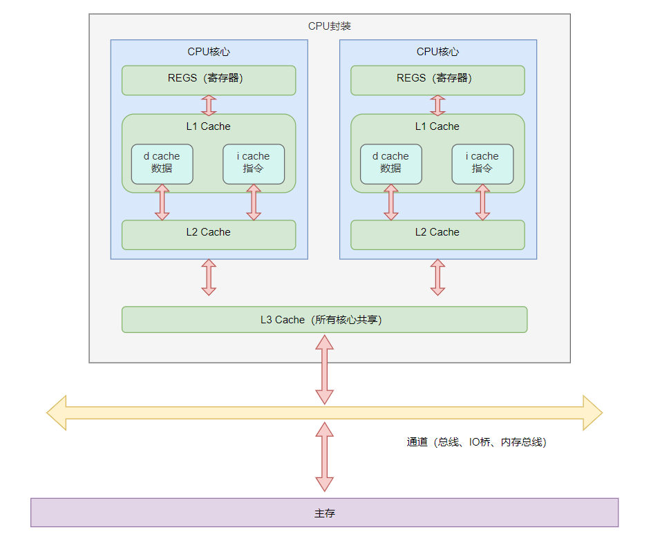

## 计算机缓存基础

### 高速缓存

#### 什么是高速缓存？

在当前的计算机架构中，CPU处理数据的速度已经大大超过内存的访问速度，如果CPU所有计算所需要的数据每次都从主存中去获取的话，会极大的影响CPU的计算速度。因此在CPU和主存引入了高速缓存（Cache）来解决这个问题。现代计算机可以存在多核情况，每个CPU核心都有自己的缓存。架构如下：

在现代计算机中，高速缓存的会分层级，目前一般是三级（L1 Cache、L2 Cache、L3 Cache），当然也可能会有更多的层级。一级缓存是离CPU最近的缓存，一般是直接嵌入在CPU的内核中。离CPU越近，其存取的速率也就越快，制造成本也越高，因此其容量也越小。

#### 高速缓存的结构

高速缓存采用的是散列表的结构来存储数据，其Key为内存地址，Value为内存数据的副本或者是即将写入内存的数据。其内部结果与Java中的hashMap比较类似。它包含若干的桶（Bucket），在桶中又包含若干的缓存条目（cache Entity）

-16599674317743.png)

每个缓存条目分为三个部分：

1. Data Block：也称为缓存行（Cache Line），高速缓存在读取数据的时候会根据空间局部性和时间局部性原则会把缓存数据周边的数据都会加载进来，所以一个缓存行可能记录多个变量的值。一般其大小为16~256字节不等。
2. Tag：标记位，记录缓存行数据对象的内存地址的部分信息（内存地址的高部分比特）
3. Flag：有效位，记录缓存行的状态信息数据。

#### 缓存命中过程

CPU如何判断数据在缓存中是否存在呢？首先CPU要读取内存的数据时，是根据具体的内存地址去获取数据的，这时候会先将内存地址进行解码，解码的结果分为三个部分：index、tag、offset

1. index：这个值与高速缓存的桶的序号时对应的，根据index可以确定唯一的桶位置。
2. tag：这个值时记录与高速缓存条目中的TAG对应，根据这个值来确定具体的缓存条目。
3. offset：找到具体的缓存条目中之后，因为缓存行中存的是内存中连续的一些数据，offset就是相对缓存行起始位置的偏移量，根据offset就能确定唯一的数据。
4. 根据上面内存地址的解码结果就能找到对应的缓存行的数据了，最后还得根据缓存条目的flag状态来确定是否命中，如果flag值为无效，就表示未命中， 如果值为有效，则命中。

### 缓存一致性协议

当多个CPU核心共享一些变量时，每个CPU都会缓存一份主存数据的副本在缓存行中，此时需要一种通信机制来保证各核心中的缓存数据更新能及时被其他的核心感知到，解决脏读问题。这种通信机制就叫做缓存一致性协议。比较常见的缓存一致性协议叫MESI。

#### MESI缓存一致性协议

MESI协议对内存的操作类似与读写锁，针对读操作是并发的，但是同一时间对于同一地址的写操作是独占的。它通过对缓存条目中的Flag标记一组消息来实现缓存一致性。

MESI协议把缓存条目的Flag分为四种状态

1. M：Modified（已经被更改过的）。此状态标记当前缓存条目的数据被更新了，此时该处理器的缓存行对应的数据和主存中不一致。同时，MESI协议规定更改数据只能在同一时间对于同一地址的写操作，所以多个处理器核心上Tag值相同的缓存条目中，只能一个缓存条目处于此状态。
2. E：Exclusive（独占的）。此状态表示当前缓存行包含了与对应主存对应的副本数据，此时该处理器的缓存行对应的数据和主存一致，并且此时是以独占的方法保存的，即除了当前处理器的缓存行之外，其余的缓存行都不包含当前数据的有效副本。
3. S：Shared（共享的）。此状态表示当前缓存行包含了与对应主存对应的副本数据，此时该处理器的缓存行对应的数据和主存一致，并且除了当前处理器的缓存行之外，其余的缓存行都包含当前数据的有效副本。
4. I：Invalid（无效的）。此状态表示当前缓存行不包含与对应主存对应的有效副本。

---

MESI协议定义了一些消息，用于协调数据的读取和写入操作，消息如下：

| 名称                   | 类型 | 描述                                                         |
| :--------------------- | :--: | :----------------------------------------------------------- |
| Read                   | 请求 | 通知主存、其他的处理器当前处理器准备读取某个数据。消息中包含本次需要读取的数据的内存地址。 |
| Read Response          | 响应 | 消息中包含Read请求需要的数据。这个响应可能是主存发出的，也可能是其他的处理器发出的。 |
| Invalidate             | 请求 | 通知其他的处理器将对应的缓存行条目Flag置为I，也就是失效状态  |
| Invalidate Acknowledge | 响应 | 接受到Invalidate的处理器必须回复的消息，表示对应缓存行已经失效。 |
| Read Invalidate        | 请求 | 相当与Read+Invalidate组合的效果。主要用于通知其他的处理器当前线程需要读取这个数据并且执行更新操作，让其他的处理器将对应的缓存行副本失效。收到消息的处理器需要回复Read Response 和 Invalidate Acknowledge消息。 |
| WriteBack              | 请求 | 将缓存行数据写入主存，消息中包含内存地址以及要写回的数据。   |

MESI协议下，处理器核心在读写主存数据时，在特定条件下会向总线发出对应的消息，而核心也会在总线上嗅探其他核心发出的消息，并在一些条件下对消息进行回复。

协议在线模拟网址：[MESI](https://www.scss.tcd.ie/Jeremy.Jones/vivio/caches/MESI.htm)

---

假设当前CPU有两个核心，P1、P2、P3

- 假设P1核心读取主存数据的情况
  - 如果P1核心对应缓存行的状态为 (M\E\S) 时，就会执行从对应的缓存行中加载数据，并且不会发送任何的消息到总线中。
  - 如果P1核心的状态为（I）时,这时候表示当前缓存行周不存在对应的缓存行数据，这时候会发送Read消息到总线中，这时候其他的核心P2（或者主存）必须要回复 Read Response消息给P1，消息中包含数据的副本。
    - 如果此时P2的状态时M，表示当前数据时修改过的，P2的数据和主存不一致，此时P2会先把P2对应缓存行的数据写回主存，再将对用的数据的副本组成Read Response消息回复给P1.再将P2自己的缓存行状态设置为S，P1收到消息后会把对应的缓存行数据FLAG置为S。
    - 如果此时P2的状态时E，表示当前数据是P2独占的，P2的数据和主存一致，此时P2会先把P2对应缓存行的数据副本组成Read Response消息回复给P1.再将P2自己的缓存行状态设置为S，P1收到消息后会把对应的缓存行数据FLAG置为S。
    - 如果此时P2的状态时S，则表示当前数据是共享状态，P2的数据和主存一致，此时P2会先把P2对应缓存行的数据副本组成Read Response消息回复给P1。P1收到消息后会把对应的缓存行数据FLAG置为S。
    - 如果此时P2的状态时I，那么主存把会对应主存的数据副本组成Read Response消息回复给P1。P1收到消息后会把对应的缓存行数据FLAG置为E。
- 假设P1向主存写数据的情况
  - 假设P1核心对应的缓存行的状态为（M/E），此时表示当前核心已经拿到了对应主存数据的独占权，可以直接将数据写入P1核心的缓存行中并修改P1核心状态为M，此时不需要向总线发出消息。
  - 假设P1核心对应的缓存行的状态为（S），则需要向总线发出 Invalidate 消息，通知其他的核心将对应缓存行的数据失效，即将Flag设置为I。其他的核心收到消息后，会将对应缓存行的数据失效，并回复Invalidate Acknowledge消息。P1核心收到所有核心的Invalidate Acknowledge消息之后，修改P1核心状态为E。当前P1核心独占了这块数据，这时候P1核心再将数据写入P1核心的缓存行中并修改P1核心状态为M。
  - 假设P1核心对应的缓存行的状态为（I），表示当前地址的缓存未命中，则P1会向总线发出Read Invalidate消息。此时其他的线程会按照上面读取数据的过程先回复Read Response消息，然后再回复Invalidate Acknowledge 消息，并把状态设置为I。P1收到Read Response和Invalidate Acknowledge 消息后会先修改P1核心状态为E。当前P1核心独占了这块数据，这时候P1核心再将数据写入P1核心的缓存行中并修改P1核心状态为M。

### 硬件缓冲区

硬件缓冲区可以解决什么问题呢？上面通过MESI缓存一致性协议，多个核心要和主存交互，需要发送消息以及等待其他的核心的回复，增加了这些交互会导致读写的效率会比较差。硬件缓冲区可以优化这个问题。主要通过写入缓冲区和无效化队列来实现。

#### 写入缓冲区

当我们再写入数据的时候，可能要等待其他的处理器核心回复Invalidate Acknowledge或者Read Response之后才能执行其他的指令。引入写入缓冲区之后，当前处理器核心发出Read Invalidate指令之后就可以直接将数据写入当前的写入缓冲区中，此时不再需要等待其他核心或者主存给的响应，立即就可以开始执行其他的指令。而当其他的核心或者主存响应Invalidate Acknowledge或者Read Response之后，再从写入缓冲区中将数据写入到当前核心的缓存行中。这样就能在未得到响应的时候也不需要一直等待。

引入写入缓冲区之后，数据会先写入到写缓冲区中，而此时缓存行数据还没有修改，如果直接从缓存行中读取，会读取到旧值。存储转发指的是，读取数据时。先会从写入缓冲区中寻找，没有值才会去缓存行中寻找。这个操作叫做**存储转发**

#### 无效化队列

和写入缓冲区类似，无效化队列使得收到Invalidate消息的核心不需要先失效消息对应的缓存行数据，而是直接写入无效化队列，就可以回复Invalidate Acknowledge消息，这样就减少了写操作核心的等待时间。

#### 重排序问题

写缓冲区可能会造成内存重排序：

1. 造成StoreLocal重排序：指将写操作重排到了后面
2. 造成StoreStore重排序：指两个写操作发生了重排序，前面的写排到了后面的写的后面

##### 重排序的原因

其实指令在执行并不是顺序颠倒了，这里是因为写操作执行后，再某些情况下会先写入写入缓冲区中，其他的CPU核心还没有回复的时候，数据并没有写入到缓存行中，这时候会先执行后面的操作，这时候其他的核心如果来读取当前核心的数据的时候，是不会读取写入缓冲区的，而是从缓存行中读取，因为这时候数据还没写入到缓冲行中，所以读取到的值时旧的值，但是因为当前核心后面的指令已经执行了，所以对于其他的核心来说，感官上时感觉后面的操作比前面先执行的。

---

无效化队列可能会造成内存重排序：

造成LoadLoad重排序:其实和写缓冲区造成重排的效果一样，因为数据时先进入无效化队列，所以也可能存在重排的感官感受。

#### 可见性问题

写缓冲区会造成可见性问题，因为数据会先写入写缓冲区中，对于所以对于一个线程来说，它可能无法读取其他线程已经修改的值。虽然说写缓冲区在一些特定的条件下可以将缓冲区内容写入缓存行，但是这个不一定是及时的。存储屏障（Store Barrier）可以再执行指令的时候将写入缓冲区内容刷入缓存行中。

无效化队列也是一样的，失效的数据没有真正再缓存行上修改。加载屏障（Load Barrier）可以再执行的时候将无效化队列数据中对应的缓存行全部失效，这样缓存行加载数据的时候就会发出Read消息去加载最新的数据。

#### 内存屏障

内存屏障主要分为如下四种:

1. StoreStore：前面的写操作要先于后面的写操作 ：操作的是写入缓冲区，即即使当前缓存行状态是E或者M，本身已经独占了缓存行数据，他的写入也需要写入写入缓冲区中。保证写入的顺序。
2. LoadLoad：前面的读操作要先于后面的读操作：操作的是无效化队列，他会清空无效化队列，将无效化队列的变更及时写入到缓存行中。
3. StoreLoad：前面的写操作要先于后面的读操作：清空无效化队列+将写入缓冲区数据写入缓存行中
4. LoadStore：前面的读操作要先于后面的写操作
