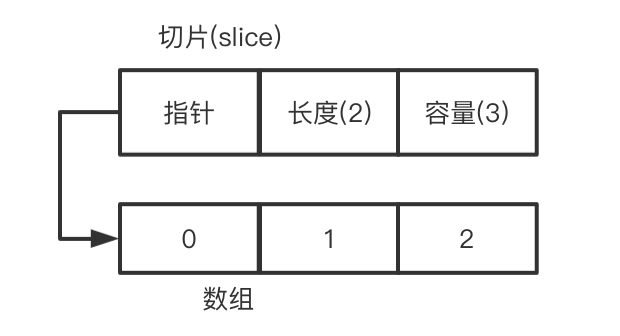
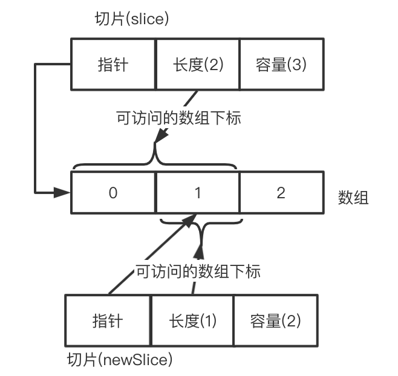
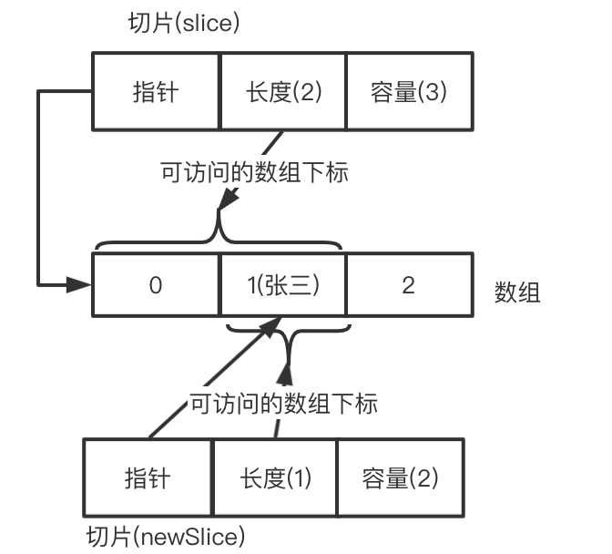
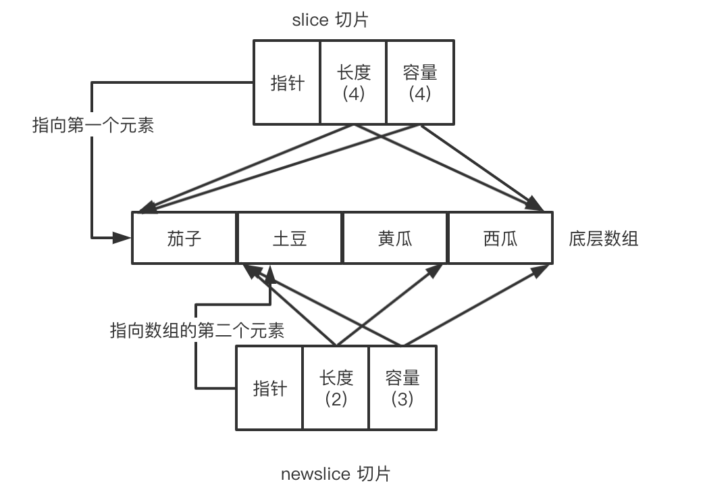
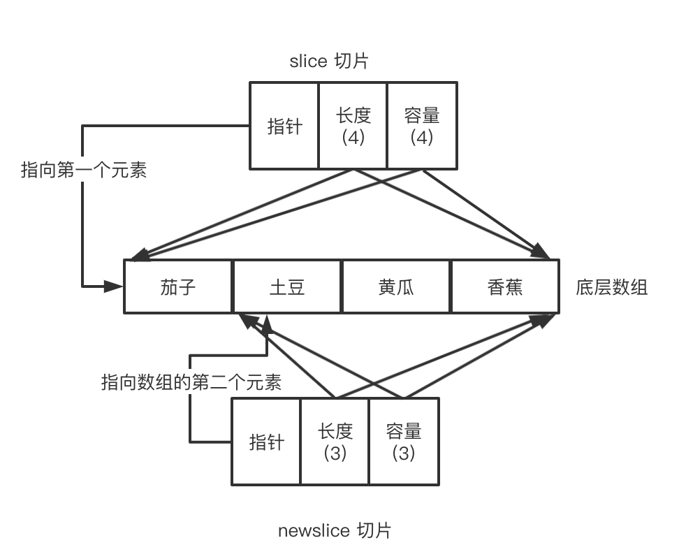
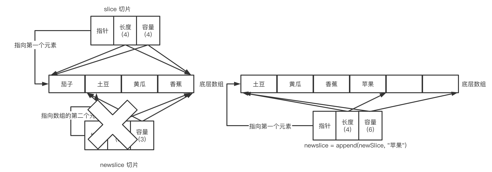

### 对切片的理解

GO中的数组是固定长度的数据结构，而切片可以理解为一个动态的数组的概念。
它基于数组并提供了动态扩容的API，在使用上可以理解为Java中的ArrayList，但是其底层还是有非常大的区别的。

#### 切片的组成
切片主要包含三个部分
1. 指向底层的数组的指针（pointer）
2. 容量（capacity） 
3. 长度（length）

从组成可以看到，切片本身是不包含数组而是拥有一个指向底层数组的指针，这个和Java中的ArrayList不同.
因为每个ArrayList都拥指向自己独有的数组的"指针"，而对于GO的切片来说可能存在多个切片对应同一个底层数组的情况。

#### 切片基础原理
定义一个切片的代码如下：

```GO
	slice := make([]string, 2)
	fmt.Println("容量：", cap(slice), "长度：", len(slice))
    // 输出：容量： 2 长度： 2
    slice = make([]string, 2, 3)
	fmt.Println("容量：", cap(slice), "长度：", len(slice))
	// 输出：容量： 3 长度： 2
```

可以看到，如果不指定容量，那么容量默认和长度相同。

那么执行完make之后，内部的数据结构是如何呢？以`slice = make([]string, 2, 3)`为例：



如图，底层会创建一个以切片容量为长度的数组，并将切片的指针指向数组的第一个元素，此时对切变的访问会根据切边的长度(length)来做限制。
此时切片的length是2，如果此时去访问slice的第3个元素，就会产生错误：
```go
println(slice[2])
// 运行报错：panic: runtime error: index out of range [2] with length 2
```

切片的英文单词是`slice`，这个名字是有意义的，我们可以从一个切片中“切”出一个新的切切片.
这个操作如下所示：
```go
	newSlice := slice[1:2:3]
	fmt.Println("容量：", cap(newSlice), "长度：", len(newSlice))
	// 输出：容量： 2 长度： 1
```
这时候底层的结构如下：


根据上面的图我们理解一下`slice[1:2:3]`后面三个数字的意义：
1. 第一个下标，这里是1:指的是新切片从原先的切片指向的数组索引为1的位置开始，这里就是指定新切片的起始下标；
2. 第二个下标，这里是2:指的是新切片的长度在原先数组的位置，这里指定为2（不是数组索引），起始位置为1，所以新切片的长度就是2-1=1；
3. 第三个下标：这里是3:指的是新切片的容量在原先数组的位置，这里指定为3（不是数组索引），起始位置为1，所以新切片的容量就是3-1=2；

这里注意，如果指定的三个下标的数值超过了原先底层的数组的长度（不是索引），会报数组越界错误。

此时这里两个切片共享一个底层数组，对其中任何一个切片的元素进行修改，都会产生相互影响。

```go
	slice := make([]string, 2)
	slice = make([]string, 2, 3)
	newSlice := slice[1:2:3]
	newSlice[0] = "张三"
	printSlice(slice, "slice")
	printSlice(newSlice, "newSlice")

	func printSlice(slice []string, name string) {
		fmt.Println("-----开始打印" + name + "的切片元素")
		for index, item := range slice {
			fmt.Println(name+" 索引为", index, "位置的数据为："+item)
		}
		fmt.Println("-----结束打印" + name + "的切片元素")
	}

	// -----开始打印slice的切片元素
	// slice 索引为 0 位置的数据为：
	// slice 索引为 1 位置的数据为：张三
	// -----结束打印slice的切片元素
	// -----开始打印newSlice的切片元素
	// newSlice 索引为 0 位置的数据为：张三
	// -----结束打印newSlice的切片元素
```



#### 切片与append函数
当我们定义好切片之后，需要添加元素我们需要使用`append`方法。

```go
	slice := []string{"茄子", "土豆", "黄瓜", "西瓜"}
	newSlice := slice[1:3:4]
	printSlice(slice, "slice")
	printSlice(newSlice, "newSlice")

    //-----开始打印slice的切片元素
	//slice 索引为 0 位置的数据为：茄子
	//slice 索引为 1 位置的数据为：土豆
	//slice 索引为 2 位置的数据为：黄瓜
	//slice 索引为 3 位置的数据为：西瓜
	//slice 长度为： 4  容量为： 4
	//-----结束打印slice的切片元素
	//-----开始打印newSlice的切片元素
	//newSlice 索引为 0 位置的数据为：土豆
	//newSlice 索引为 1 位置的数据为：黄瓜
	//newSlice 长度为： 2  容量为： 3
	//-----结束打印newSlice的切片元素
```
此时底层数组的结构如图所示，其中，slice的长度和容量都是4，即整个底层数组，而newSlice指定了`slice[1:3:4]`,即其本身的容量是3，但是此时切片长度为2


此时我们执行第一次添加数据：
```go

    newSlice = append(newSlice, "香蕉")
	printSlice(slice, "第一次添加数据后：slice")
	printSlice(newSlice, "第一次添加数据后：newSlice")
    //-----开始打印第一次添加数据后：slice的切片元素
	//第一次添加数据后：slice 索引为 0 位置的数据为：茄子
	//第一次添加数据后：slice 索引为 1 位置的数据为：土豆
	//第一次添加数据后：slice 索引为 2 位置的数据为：黄瓜
	//第一次添加数据后：slice 索引为 3 位置的数据为：香蕉
	//第一次添加数据后：slice 长度为： 4  容量为： 4
	//-----结束打印第一次添加数据后：slice的切片元素
	//-----开始打印第一次添加数据后：newSlice的切片元素
	//第一次添加数据后：newSlice 索引为 0 位置的数据为：土豆
	//第一次添加数据后：newSlice 索引为 1 位置的数据为：黄瓜
	//第一次添加数据后：newSlice 索引为 2 位置的数据为：香蕉
	//第一次添加数据后：newSlice 长度为： 3  容量为： 3
	//-----结束打印第一次添加数据后：newSlice的切片元素
```

这里可以看到，对newSlice进行append添加数据之后，也会同时修改slice的数据，这是因为其底层的数据是共享的。append中后的结构如下


这里，对newSlice进行添加数据的时候，因为本身容量为3，当前长度是2，它还有空间，所以会直接将数据'香蕉'覆盖原先的'西瓜'，因为对于newSlice来说，本身'西瓜'位置的元素对他来说是未使用的。

此时我们再对newSlice进行第二次添加数据
```go
	newSlice = append(newSlice, "苹果")
	printSlice(slice, "第二次添加数据后：slice")
	printSlice(newSlice, "第二次添加数据后：newSlice")
	//-----开始打印第二次添加数据后：slice的切片元素
	//第二次添加数据后：slice 索引为 0 位置的数据为：茄子
	//第二次添加数据后：slice 索引为 1 位置的数据为：土豆
	//第二次添加数据后：slice 索引为 2 位置的数据为：黄瓜
	//第二次添加数据后：slice 索引为 3 位置的数据为：香蕉
	//第二次添加数据后：slice 长度为： 4  容量为： 4
	//-----结束打印第二次添加数据后：slice的切片元素
	//-----开始打印第二次添加数据后：newSlice的切片元素
	//第二次添加数据后：newSlice 索引为 0 位置的数据为：土豆
	//第二次添加数据后：newSlice 索引为 1 位置的数据为：黄瓜
	//第二次添加数据后：newSlice 索引为 2 位置的数据为：香蕉
	//第二次添加数据后：newSlice 索引为 3 位置的数据为：苹果
	//第二次添加数据后：newSlice 长度为： 4  容量为： 6
	//-----结束打印第二次添加数据后：newSlice的切片元素
```

此时可以看到，newSlice的容量直接扩容了两倍，而slice的切片的容量没有变化！这是怎么回事呢，看下图：


这里newSlice进行append的时候，因为其length和容量相等，即其本身的元素已经满了，这时候添加元素底层数组也没有空间了，这时候会创建一个容量双倍的底层数组，并将原本的数据进行一次数据的拷贝，放入新创建的数组中，这时候再将数据'苹果'放入新添加的数组中，而新的切片会会将数组的指针，指向新创建的数组的第一个元素。

#### 小结
1. 对于切片，它是一种不可变的数据结构，对数组进行赋值都是操作的底层的数组
2. 对切片进行`append`操作，每次都会创建新的slice对象，所以每次`append`之后，都要为局部变量重新赋值
3. 扩容的容量，在容量小于1000时，每次都是双倍扩容，当超过1000之后每次都是1.25倍扩容