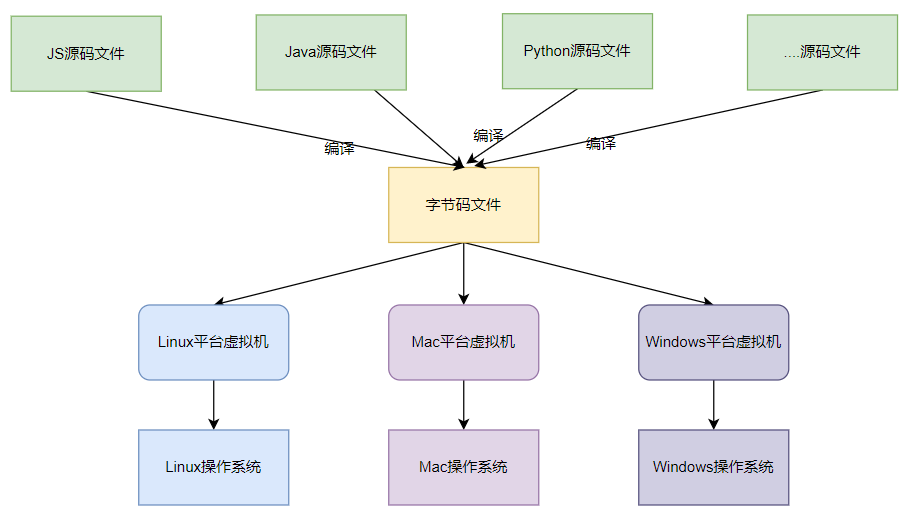

#### Java体系结构主要包含了哪些方面

- Java语言本身
- Java核心类库
- 运行于各平台的虚拟机
- Java字节码的文件格式和规范
- 社区提供的各种三方类库

Java发展至今，已经不仅仅时一门语言那么简单了，而是一个社区、文化了。实际上来说Java虚拟机可以认为是比Java语言本身更伟大的产品。

#### 跨平台和跨语言

##### 跨平台特性

Java出现时，号称是**一次编写，处处运行**，其核心是Java提供了不同平台（Windows、Linux...）的虚拟机实现。对于相同的字节码文件，不同平台的虚拟机会产生相同的执行结果，虚拟机屏蔽了底层操作系统层的差异性。

Java虚拟机本身是运行于操作系统上的，其本身不与应交直接交互，这里跨平台其实我个人理解是跨多个操作系统。

##### 跨语言特性

Java的跨语言其核心是Java体系中的字节码文件，不同的编程语言提供不同的编译器，将其源码编译成相同字节码格式的文件，而对于下层的虚拟机来说，只要字节码格式正确，它根本不关系此字节码是由何种语言编写，由哪个编译器编译的。
