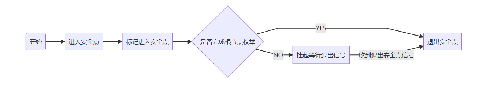
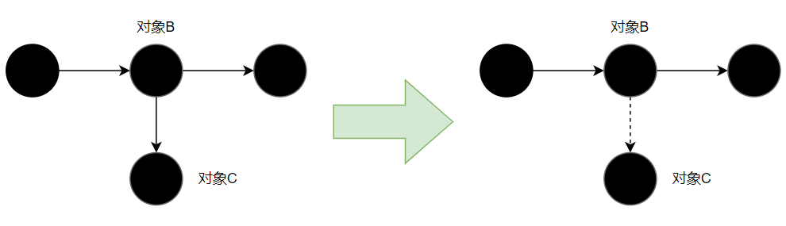
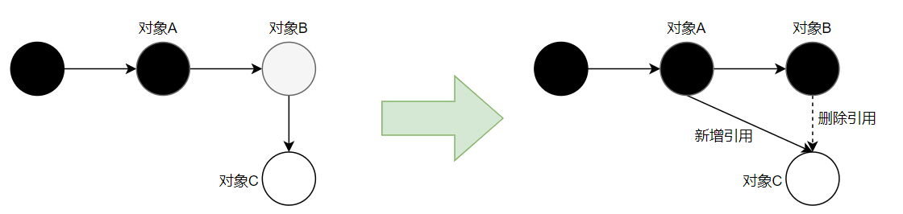
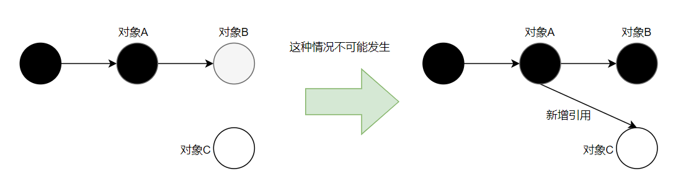
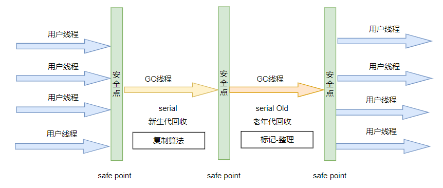
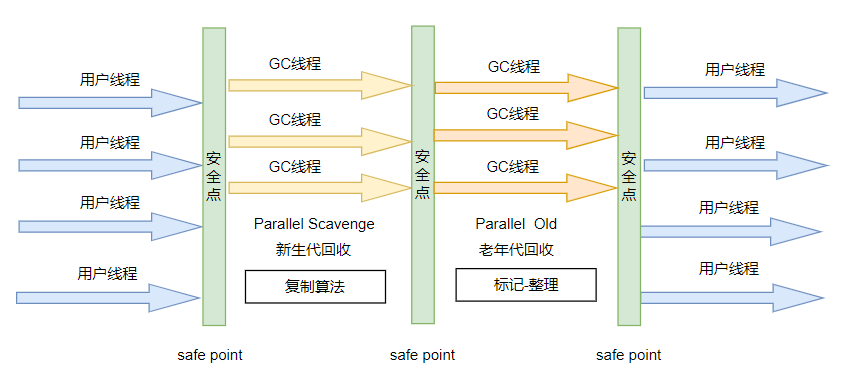

### 垃圾回收相关流程和实现

总的来说，垃圾回收过程总的来说需要做如下的事情：

1. 找到需要回收的对象
2. 执行具体的垃圾回收流程

其中找到需要回收的对象有很多的理论和算法的支撑，尽量让寻找对象这个过程高效、安全。

而针对具体的垃圾回收的操作，不同的虚拟机有自己的实现，他们对于内存的使用方式不同，其使用的回收算法也会有很大的差异。

#### 如何寻找到需要回收的对象

寻找需要回收对象的过程就是寻找应用中不再使用中的数据，那么什么样的数据是不再使用的呢，这里主要是用户使用的角度上不能再访问到的对象（即没有引用能访问到此对象）。

这里我们提到了引用，Java中也提供了对引用的四种定义方式：

1. 强引用：这种方式就是我们最常使用通过等号进行设置引用的，如`Object o = new Object()`。强引用的对象垃圾回收器在任何时候都不会进行对此对象进行回收。
2. 软引用：通过SoftReference包装创建，如 `SoftReference aSoftRef=new SoftReference(new Object()) `。在GC过程中如果剩余的内存空间不足，会将软引用的对象进行回收。这个通常用于做缓存对象的存储使用。
3. 弱引用：通过WeakReference包装创建，如`WeakReference<People>reference=new WeakReference<People>(new Object())`。在GC过程中会直接对弱引用对象进行回收。
4. 虚引用：虚引用是一种最弱的的引用，它在任何时候都可能会被垃圾回收器进行回收。

---

这里通过引用去找到需要回收的对象有两种方式：

1. 引用计数法：一个对象如果被其他的对象所引用，那么这个对象的引用值就+1，如果引用断了那么这个对象的引用值就-1。如果一个对象的引用值为0，那么叫代表这个不会再使用了，因为已经没有对象引用它了。
2. 可达性算法：通过一组程序中定的ROOT对象（可以理解为引用的起点，比如栈中的局部变量表、方法区的常量池和静态变量所引用的对象等）的引用一直向下找，将这条链路上面所有找到的对象标记为可达对象（即是不需要回收的对象），除此之外的其他的数据就可以认为不会再使用了。

我们可以再深入去分析一下这两种方式：

使用引用计数法有循环引用的问题，就是如果两个对象互相引用对方，虽然循环引用的问题可通过 Recycler 算法解决，但是在多线程环境下，引用计数变更也要进行昂贵的同步操作，性能较低，早期的编程语言会采用此算法。

使用可达性分析算法的话，就可以解决引用计数法的循环引用的回收问题。

---

#### 常用的垃圾回收算法

常见的垃圾回收算法有三种：

1. 标记-清除：第一阶段先通过可达性分析，对存活的对象进行标记。第二阶段是对未被标记的对象进行回收。这种方法会在回收之后在内存之后产生内存碎片，这个对后续大对象的分配不利。
1. 标记-整理：第一阶段先通过可达性分析，对存活的对象进行标记。第二阶段会将存活的对象进行移动顺序整理。这样就在回收之后内存中不会产生内存碎片。
1. 复制：首先在内存的分配上，将空间划分为两个区域，From区和To区。对象的分配都只会在其中的一个区域进行分配。回收时，第一阶段对当前使用的区域中存活的对象进行标记，第二阶段会将存活的对象直接复制到另外一个半区，并清空上次使用的分区。这种方式有两个缺点，第一是因为内存在同一时间只使用其中的一个半区，所以整体的内存使用率不高。第二是在复制时的成本比较高。

#### 垃圾回收的基础理论

在后续介绍垃圾回收器实现的时候会涉及一些概念，这边统一规整到这里

##### 分代回收理论

垃圾回收都会基于分代回收理论进行设计，它的核心概念有如下三个：

1. 弱分代假说：绝大多数的对象都是**朝生夕死**的。
2. 强分代假说：熬过垃圾回收次数越多的对象越难被回收。
3. 跨代引用假说：跨代引用相对于同代引用只是极少数。

上述概念比较抽象，我们可以这样理解，我们在实际的业务代码中，绝大多数的对象都是只在方法内使用的，这些对象在方法出栈，栈帧被销毁的时候就需要被回收，所以这些对象的生命周期都很短，如果一个对象经历了很多次垃圾回收之后还存活，那么说明这个对象就难被回收，可达性分析总能标记到它。所以垃圾回收器在做实现的时候，就可以根据如上的理论，将堆空间分成不同的逻辑上的区域，将朝生夕死的对象和那些难以被回收的对象分开放置。基于这种概念，会把堆区分为**新生代**和**老年代**。其中新生代用于存放那些刚创建的对象，而那些难以回收的对象就会移入老年代，垃圾回收器以较少的频率去扫描回收老年代，这样就减少了回收过程需要扫描的堆空间而加快回收的速度。

这里有一个细节的地方是，对象之间可能存在跨代引用，即新生代的对象可能引用着老年代的对象，老年代的对象也可能引用着新生代的对象。但是这种情况比较少的：比如一个新生代对象A，引用着老年代的对象B，如果A是一个朝生夕死的对象，其跨代引用会随着A的回收而消失，否则A也会慢慢变成老年代，这样他们之间就不会存在跨代的引用了；如果一个老年代对象A，引用着新生代对象B，因为A难以回收，那么B也会因为存在引用而慢慢变成老年代。但是毕竟还是会存在跨代引用的情况，这里虚拟机一般会使一个容器（remebered set）来记录哪一块内存区域的老年代会存在跨代引用，这样在垃圾回收的时候会将这部分老年代对象加入 GC ROOT对象进行可达性分析，这样就不需要扫面整个老年代了。

##### 快速根节点枚举-OopMap

我们根据可达性算法做GC的时候首先需要找到系统中当前的所有的根节点（GC Root），目前对于一个Java应用来说，运行期其中的类、栈都非常多，如果一个一个的去遍历找到这些GC ROOT对象也是非常花时间的，而现在几乎所有的垃圾回收器在根节点枚举的阶段都需要将用户线程停止（STW），所以虚拟机为了快速的枚举出系统中的根节点对象，使用了一个叫做 `OopMap`的数据结果来存储。其本身时在即时编译阶段进行维护的。

##### 安全点与安全区域

`OopMap`解决了快读根节点枚举的问题，但是还有一个问题，就是程序运行期间每个指令都可能导致根节点的变化，如果对于每个指令都生成对应的`OopMap`对象，这个造成的存储成本会非常巨大。

所以JVM设置了叫做`safe point`的概念表示到达了具体的位置之后才会进行`OopMap`的维护。这里因为安全点的引入，用户线程就不能在任意时刻都可以停下来(STW)做垃圾回收，因为此时OopMap还没有维护好，所以必须到了安全点之后才能进行垃圾回收。

如果当前需要进行垃圾回收，那么就必须先让所有线程到达安全点，然后让其停下来。这里主要有两种方案：

1. 抢占式中断：系统先中断所有的用户线程，然后发现如果有用户线程不在安全点上，那么就恢复其运行，之后过一会再中断它直到它到了安全点。
2. 主动式中断：系统不会主动中断用户线程，而是设置一个标记位，用户线程在运行时不断地去判断标记是否为真，如果为真，那么其在运行到最近的安全点之后会主动中断挂起。

有了安全点看似已经完美无缺了，但是还有小问题，如果某个线程本身就处于Sleep或者blocked的状态，系统也不大可能等待其跑到安全点之后再中断进行垃圾回收。所以引入了安全区域的概念。

我们可以把安全区域理解为一段被拉长了的安全点，其本身表示在这段区域引用关系不会发生变化。比如Sleep或者blocked状态时，引用是不会发生改变的。GC时不会去管在安全区域的线程，因为其已经维护好了OopMap了。

具体的逻辑如下：

1. 当用户线程运行到安全区域的代码时，会标识自己处于安全区域。
2. 当线程要离开安全区域时，就需要判断
   1. 如果当前虚拟机没有完成根节点枚举，或者垃圾回收器需要中断用户线程（GC 根节点枚举、STW阶段等），它会一直等待，直到收到离开安全区域的信号才会继续向下执行。
   2. 除此之外就可以直接向下执行。



##### 并发可达性分析

如果要做到在用户线程还在运行的期间做到可达性分析（就是在对象标记期间和用户线程同时执行），hotspot虚拟机采用的是**三色标记算法**。

总的来说，是将堆中所有的对象按照三种颜色来区分其在可达性分析中的访问状态：

- 白色：表示对象未被访问过。当可达性分析刚开始时，系统中所有的对象都是白色的，当可达性分析结束后，如果对象还是白色，就会认为是垃圾对象将其回收。
- 灰色：表示对象被访问过，但是这个对象上还有引用没有被访问。举个例子，比如一个对象是User类的对象，其内部有一个属性是Address对象，那么如果这个User对象被访问了，但是还没有扫描到其指向内部的Address对象的引用，那么这个User对象就是灰色。
- 黑色：表示对象被访问过，且其中所有的引用都完成了扫描。这个对象是安全存活的，如果其他对象在做分析时指向了一个黑色的对象，那么就不需要再往下扫描了。黑色对象是不能直接指向白色对象的，因为黑色对象内部的引用都是被扫描过的，所以他们至少都是灰色的。

当系统扫描结束后，会将所有的白色对象当成垃圾对象回收。这个看起来很完美，但是还是有问题，因为是和用户线程并发执行的，所以对象的引用时会发生变化的。其可能造成以下两种标记结果不准确的结果：

1、在对象引用变化之后，原本标记为存活状态的对象变成了死亡对象。如下图，在标记期间，原先对象C被标记为了黑色，但是因为用户线程把对象B指向对象C的引用删除了，那么C就变成了死亡对象，但是其颜色已经被标记成了黑色，回收器是不会将其回收的。但是这种不准确的结果是可以原谅的，因为最多是产生一些叫做**浮动垃圾**的产物，这部分数据不会很多，留着下次回收问题也不大。



2、在对象引用变化前后，将原本死亡的对象变成了存活的对象。这个可以理解为，原本白色的对象被使用了，如果不做处理，这个对象被回收就会出现很大的问题。如果解决这个问题呢？我们要先看下是如何产生问题的：



如上图，对象A已经被标记为黑色了，对象B因为还没有扫描其指向对象C的引用，所以对象B是灰色，而对象C是白色。如果在运行期间，对象A**先**新建了指向对象C的引用，**然后**删除了对象B指向C的引用，由于黑色对象A不会再重新扫描，所以对象C会被当成垃圾对象删除掉。总结出了对象被误删的条件如下（要全部满足）：

1. 新增了从黑色对象到白色对象的引用。
2. 删除了灰色对象到白色对象的引用。

其实最开始我没有理解什么需要满足上面两者所有的条件，我认为是只要满足1就可能发生对象消失的问题，比如下图，如果原先对象C没有对象引用，然后黑色对象A指向了对象C。**思索再三发现这种场景不会发生**，第一，如果对象C没有对象引用它，用户已经无法操作这个对象了，就不会发生对象A重新指向C的引用。第二，如果说对象C是在可达性分析期间新建的对象，那么其会放在一个单独的列表中，不会参与这次可达性分析，所以不会被清理。



所以如果需要解决上面对象消失的问题，只要破坏上面两个条件之一即可，所以诞生了如下两种解决方案：

1、增量更新：其破坏的上面第一个条件，当新增一条黑色到白色的引用时，利用写后屏障，记录这个删除对象引用的根对象，对应上面图中就是对象A，其本身时黑色的对象，因为新增了到C的引用，所以将A记录下来，在并发标记结束后，从对象A开始重新扫描，此时，对象C就会被重新标记为存活了

2、原始快照：其破坏的上面第二个条件，当删除一条灰色到白色的引用时，利用写后屏障，将这个引用记录下来。对应上面图中，因为删除了灰色对象B到对象C的引用，所以，将这个删除的对象引用记录下来，在并发标记之后，根据这个记录的引用再扫描，根据引用标记这个对象存活。这个可能不好理解，其实可以这样认为，如果删除了灰色对象到白色对象的引用，那么就可以认为其没有删除，再并发标记之后还是会根据记录的删除引用，将对象重新标记。其本身就像记录删除前引用的快照一样，只会按照引用变更前的对象图进行标记。这种方式可能会产生一些**浮动垃圾**，比如对象本身确实是需要删除的，但是因为原始快照，会认为其存活。

#### 垃圾回收器的具体实现

垃圾回收器实在是非常复杂、抽象的概念，如果不去具体看虚拟机的源码实现，只是纸上谈兵实在是难以将其概念和原理都解释清楚。这里只是根据书籍和一些收集的资料希望尽可能将各种垃圾回收器的实现进行一些概念上的整理。思来想去，这一篇想根据具体的垃圾回收器的实现，再过程中引入一些垃圾回收的算法实现细节，希望能将其描述的更清晰一些。

这里我们根据垃圾回收器的发展历史，逐个看看对其进行描述。

##### Serial/SerialOld回收器

Serial垃圾回收器是一款最基础并且历史最悠久的面向**新生代(参考上面分代回收理论)**的垃圾回收器，而SerialOld则是面向**老年代(参考上面分代回收理论)**的垃圾回收器。和其名字一样，它们在做回收过程中的所有步骤都是单线程执行的。如下图：



这里我们需要从左到右看下GC的流程：

首先是用户线程的执行，当运行一段时间后触发了GC的条件(`eden`区域满了)，此时到达**安全点**之后会将所有用户线程挂起，并使用一条GC线程做**新生代**垃圾回收，此时是`serial`回收期在做处理，并且其采用的是**复制**算法。

而老年代的回收是使用的`serial Old`回收器，其使用的**标记整理**算法。

这里我们可以看到，Serial/SerialOld回收器都是在中断用户线程之后采用单线程进行垃圾回收的。在垃圾回收阶段用户线程都会做停顿，STW的时长会比较长。

但是Serial回收器不是一无是处，其本身在`-client` 客户端模式下是默认的垃圾回收器。因为其简单高效，在一些单核或者资源受限的场景下，内存不大的情况，每次GC控制在十几毫秒，对于客户端程序来说还是可以接受的。

##### ParNew回收器

`ParNew`垃圾回收器本质上是`Serial`垃圾回收器的多线程版本。同样是面向新生代的垃圾回收器、采用复制算法，并且进行GC过程中是需要STW的。区别是在做新生代回收的时候，会有多个GC线程同时做GC回收，按照并发的知识，如果系统只有单核，多线程执行过程会因为上下文切换反而降低性能，只有在多核时情况下会有性能的提升。

如此看来ParNew垃圾回收器好像并没有什么特别的用处，但是其本身却是CMS垃圾回收期除了Serial回收器之外的唯一新生代选择。

##### Parallel Scavenge / Parallel  Old 回收器

`Parallel Scavenge`垃圾回收器和`ParNew`的特性几乎是一样的：新生代的垃圾回收器、采用复制算法、并且进行GC过程中是需要STW，并且也是进行多线程的回收。他们本质的区别是Parallel Scavenge更关注的是提升系统的吞吐量：

```tex
吞吐量 = 运行用户代码的时间 / 运行用户代码的时间 + 垃圾回收运行的时间
```

`Parallel Scavenge`回收器提供了参数配置垃圾回收的期望时长，或者直接配置GC占比时长。

如果配置了期望的GC时长（-XX：MaxGCPauseMillis=xxx），那么`Parallel Scavenge`会尽可能在期望的时间内完成本次垃圾回收，但这个值不能配置的过小，因为配置小了，那么系统会自动把新生代调整的小，这样回收的空间更小就能在期望的时间内完成GC，同样因为新生代变小了，那么GC就会更加频繁，反而降低了吞吐量。

如果配置了垃圾回收时长的占比（-XX：GCTimeRatio），即 垃圾回收时长为 1 / (1 + XX：GCTimeRatio)。

另外通过（-XX：+UseAdaptiveSizePolicy）参数，那么就不需要手动配置堆内存等大小，系统会监控运行的状态，自动调节各区域的大小来获取最大的吞吐量。

`Parallel  Old`回收器是`Parallel Scavenge`的老年代版本，支持并发回收、标记整理算法。其本身就是为了配置`Parallel Scavenge`做老年代回收的，在`Parallel  Old`出现前，因为`Parallel Scavenge`无法和`CMS`回收器配合使用而只能选择`serial old`导致其处于比较尴尬的位置。



##### CMS回收器

CMS（Concurrent Mark Sweep）垃圾回收器是一款面向老年代的垃圾回收器，采用的是标记清除算法，其最大的特点是在一定程度上是可以和用户线程并发运行的。

其回收的大致流程如下：

1. 初始标记：即标记**GCROOT**对象，这个阶段是需要**STW**的，但因为**OopMap**的存在所以这个阶段会很快。
2. 并发标记：通过可达性分析，标记所有的存活对象，**这个阶段是和用户线程并发执行的**。并发标记期间，对象的引用关系可能会变化，如GOROOT对象的变化、对象的引用关系变化等。所以使用了**三色标记法**，并且因为对象关系变化，会采用**增量更新**的方式记录引用变化的对象。
3. 重新标记：针对并发标记期间产生变化的的部分对象重新进行标记，这个阶段是**STW**的。因为整体来说这部分对象会很少，所以在这个阶段停留的时间也会很少。
4. 并发清理：将三色标记结果所有的不可达对象都进行清理，**这个阶段也是和用户线程并发执行**的。

这样一看，CMS垃圾回收就很完美，因为其大部分GC的时间是与用户并发的。但是也有一些问题：

1. 第一因为其并发标记和并发清理的特性，所以其本身是需要占用系统的资源的，默认来说其启动的并发GC线程数是系统核数量的四分之一。特别是核心数小的情况下，用户线程本身就需要运行还需要分配线程做GC，其实是会影响用户线程的执行的。
2. 第二因为在并发标记清理期间，用户线程还是在不断运行，其本身还是会产生新对象和垃圾，但是在并发回收期间是不能处理浮动垃圾的，所以如果新分配对象没有空间了，就会停止CMS回收而采用**SerialOld**回收器完全暂停用户线程进行垃圾回收。为了应对这种情况CMS不会等待老年代快要满了之后才会进行垃圾回收，而是当老年代对象占比数量到达一定比例就开始进行CMS回收了。当然这个比例可以设置，设置太小会造成系统GC太过频繁，降低系统的吞吐量。太高可能会触发**SerialOld**回收。
3. 第三因为CMS是采用标记清除的算法，所以其内存会产生内存碎片，这个非常影响大对象的内存分配。如果因为空间碎片而无法为大对象分配内存，就会产生**STW**的**FULLGC**。所以CMS提供了参数，控制其自动进行内存碎片整理，其实就是移动对象的位置，但是因为移动对象涉及到对象的拷贝期间是没办法与用户线程并发（因为复制对象之后要修复原先指向旧对象的引用地址），所以也会造成长时间的停顿。

