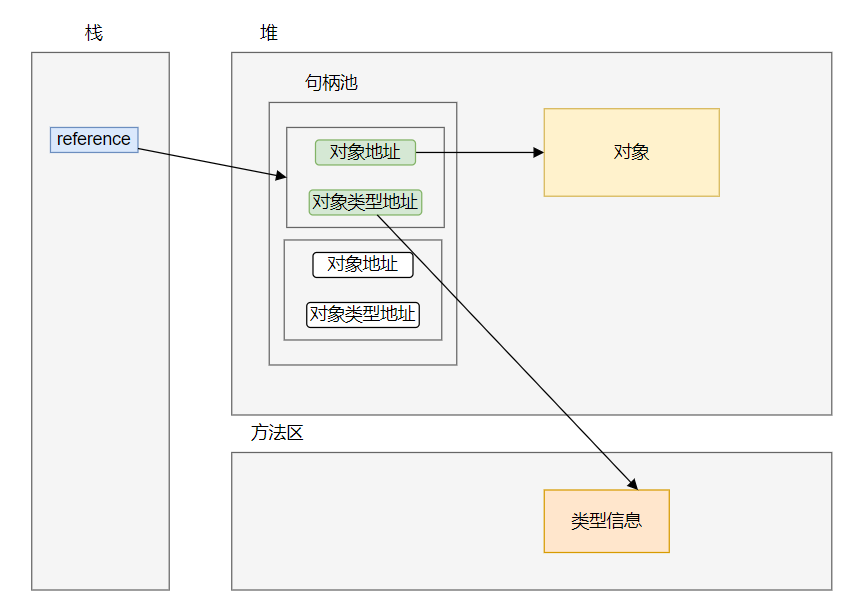
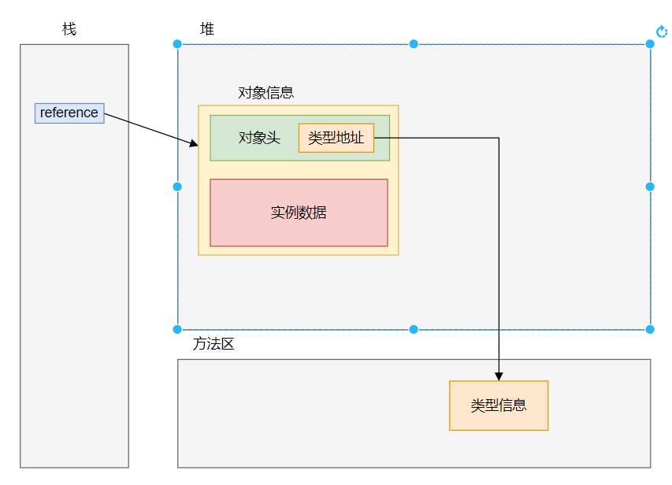

### 如何访问对象

方法中访问对象有两种方式：直接访问和基于句柄池访问

#### 基于句柄池访问

在堆空间中存在一块专门的区域，用于存储对象的句柄信息（对象的地址+对象的类型地址），栈的reference会存储所需要访问对象的句柄的地址，找到句柄之后，就能拿到所需要的对象的地址和类型信息地址。

#### 直接访问

栈的reference会直接存储对象的地址信息。

#### 两种访问方式的比较

1. 直接指针：Reference直接存储堆中对象的地址，这时候对象的内存布局中就需要考虑如何存储这个对象的类型信息。直接指向对象的话，不像句柄需要两次的指针定位，只需要一次定位就可以找对需要使用的对象信息，因为对象的访问非常的频繁，所以积少成多，其实也节约了很大的运行成本。**HotSpot采用这种方式来进行对象访问**

2. 句柄：在堆区中维护一个句柄池，此时Reference直接指向句柄池中的稳定的句柄的地址，而句柄池维护指向对象的指针和指向对象类型的指针。