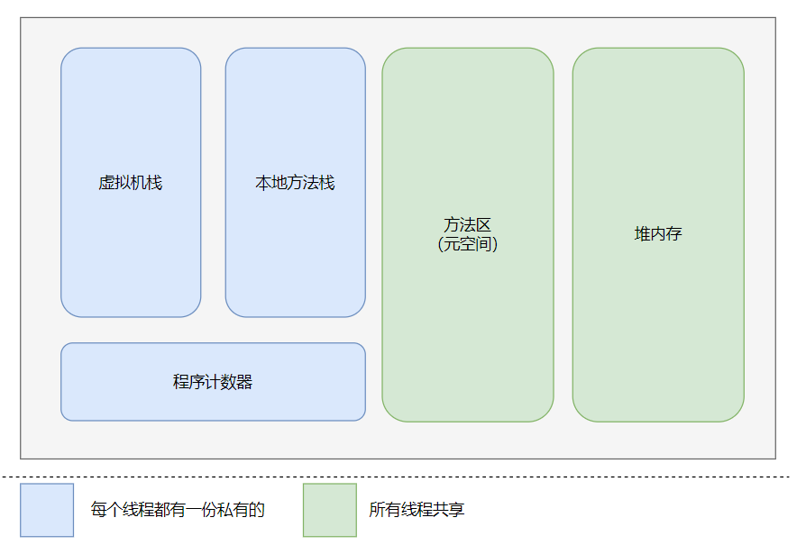

### 概述

运行时数据区是官方提出的虚拟机规范中一块区域，它规定了虚拟机在运行时将物理内存针对不同的使用方式分为不同的区域。

### 运行时数据区由哪些部分组成

如下图是官方针对运行时数据区的一些基础的区域划分：

可以看到，这里主要分为两个部分，一个是线程私有的区域，一个是所有线程共享的区域：

- 线程共有的区域：指的是所有的Jvm线程都能访问的空间
  - 堆空间：这里主要是存储程序中的实例对象数据
  - 方法区（元空间）：这里主要存储的是类信息以及常量池，类加载之后会生成一个Class对象，这个会放在方法区中。
- 线程私有空间：值得是每个线程自己私有的内存区域，即每个线程都有一份且互相不能访问
  - 程序计数器：存储程序执行的位置
  - 虚拟机栈：JVM虚拟机是一个栈结构的指令集架构，每个方法的执行都是将方法执行上下文封装成栈帧，然后对栈帧出栈和入栈的过程。而虚拟机栈就是存储栈帧的一块内存区域。
  - 本地方法栈：其作用是和虚拟机栈一样的，不过它所有执行的方法是一些本地方法，即非Java语言本身实现的方法。通过JNI可以让Java调用其他语言的方法，而本地方法栈就是存储本地方法栈帧的容器。

### 运行时数据区各个区域的作用

这里咱们将Java运行时的内存分为两大类，一类是所有线程共享的内存区域，一类是线程私有（即随着线程启动而分配，随着线程结束而卸载的区域）。

1. 线程私有的内存区域

   - 程序计数器：这块内存区域是用于存储当前线程的执行位置，字节码解释器在执行过程中就是通过改变这个值来选取下一条指令的执行位置，通过改变这个值，来完成程序的分支跳转、循环、异常处理等操作。因为这块区域本身只需要存储一个执行的位置（行号）数据，本身所需要的大小是非常小的。
   - 虚拟机栈和本地方法栈：因为者两块区域所存储的数据大致上来说是一样的，所以可以把他们放在一起来介绍。因为JVM采用的值栈指令结构，所以每个方法的执行前都会将方法执行的上下文封装成一个栈帧，方法的执行和返回就是这个栈帧从虚拟或者本地方法栈的入栈和出栈的操作。这里我们可以大致了解一下栈帧的结构，其本身包含局部变量表、操作数栈、动态连接、方法出口等信息，其实本质上就是方法执行所依赖的一些基础的信息，这里的局部变量表是方法编译后所知的基础类型、对象类型的地址以及returnAddress类型，这些数据在编译期间就已经能确认大小，所以对于每个方法来说，在编译期间就能知道其栈帧所需要的内存大小。虚拟机栈和本地方法栈两者的区别在于：虚拟机栈是Java程序的方法执行的栈结构，而本地方法栈则是Java程序调用本地方法（即非Java实现的方法，如Native方法）所用到的栈结构。

2. 线程共享内存区域：

   - 堆区：堆区说到底其作用就是存储Java中的对象的。几乎所有的对象都是存储在堆中的，所以这块区域通常是运行时内存区中最大的一块，也是垃圾回收发生的主要区域。
   - 方法区（元空间）：这块区域主要时存储的类信息、静态变量、常量池等信息。这块区域也可能会发生垃圾回收，但是其发生的概率和回收数据的比例是非常少的，这是因为对类的回收条件是非常苛刻的，导致类的卸载情况非常少。这块区域在高版本的JDK中大多采用元空间（本地内存）来实现了。