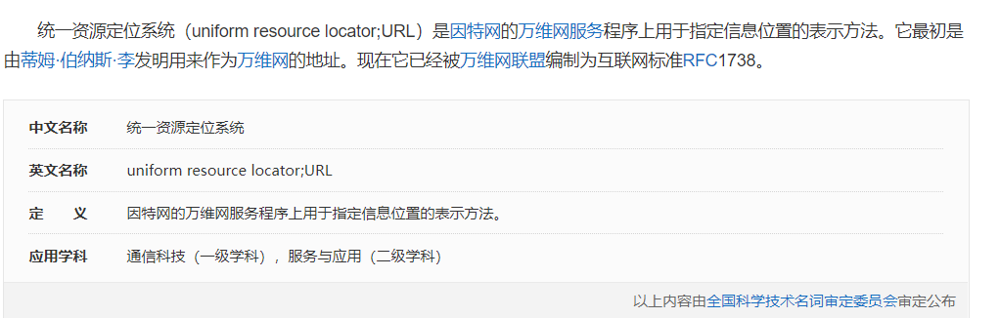
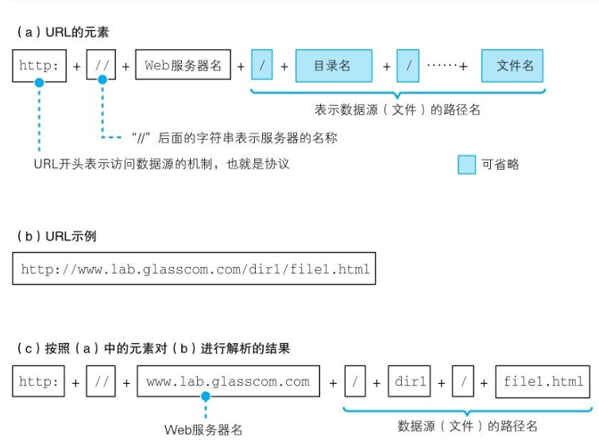

# 网络是怎么连接的笔记

## 浏览器工作原理

浏览器一般是我们日常生活中使用最多的与网络交互的的客户端，我们平时访问各种网络应用，其最核心的原理是什么呢？

其实主要分为几个方面：

1. 浏览器解析请求地址，并生成请求的消息
2. 根据请求的地址找到具体要向哪个服务器主机发送消息
3. 将请求消息委托给协议栈，让其帮助我们将消息送达目的主机

这里我们可以用一个案例来说明，比如我们访问`https://top.baidu.com/board`这个网页响应结果如下

---

### 生成请求信息

首先浏览器会解析请求地址，比如 `https://top.baidu.com/board`这个地址，首先会确认这是一个`http`的请求，因为浏览器本身支持多种应用的访问，如邮件、FTP文件等，HTTP虽然说是我们平时使用浏览器的的协议，但是其本身在设计上是支持很多的客户端的。

之后浏览器会解析的`URL`,URL是一种互联上上对资源进行定位的系统，常见的URL有FTP、MAILTO（邮件）、HTTP、NEWS等

比如HTTP的URL格式就如下：`http://<host>:<port>/<path>?<searchpart>`

URL的基础组成部分如下：

所以对于我们的`https://top.baidu.com/board`网址来说，服务器名称是 `top.baidu.com`，而资源地址是`/board`

之后浏览器会封装一个HTTP的请求协议的消息，这个就是基础的HTTP协议的格式了像请求行、请求头、请求体之类的我们已经很熟悉了就不多复述了。

### 查询服务器的IP地址

